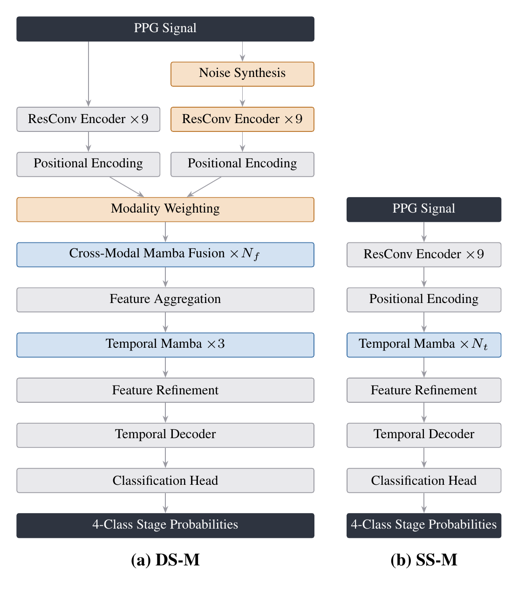
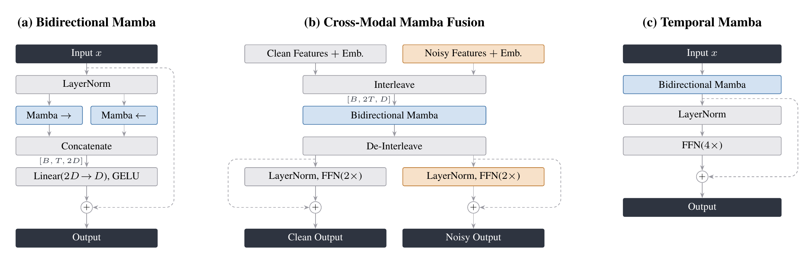

# PPG Sleep Staging with Mamba

Four-stage sleep staging (Wake, Light, Deep, REM) from a raw PPG waveform, one prediction per 30-second epoch. Code for:

> James Gray and Yu Guan. *Mamba Architectures for Efficient Sleep Staging From Photoplethysmography.* University of Warwick, 2026.

Contents: the two Mamba architectures and the two baselines they are measured against, the scripts that trained, fine-tuned and benchmarked them, the fourteen configs from the paper, the extraction code for the three NSRR datasets, and scripts for looking at the cohorts, the extracted data and the benchmark results. Trained weights are not distributed.

## Credits

Built on [DavyWJW/sleep-staging-models](https://github.com/DavyWJW/sleep-staging-models) (Wang et al., [arXiv:2508.02689](https://arxiv.org/abs/2508.02689)), which supplies the dual-stream design, the PPG corruption model, the MESA pipeline and the test split. The encoder and classifier structure follow SleepPPG-Net (Kotzen et al., [arXiv:2202.05735](https://arxiv.org/abs/2202.05735)). Mamba is by Gu and Dao, [state-spaces/mamba](https://github.com/state-spaces/mamba).

## Background

Two PPG staging models sit at opposite ends of a cost-performance trade-off, and both are included here as baselines. SleepPPG-Net is fully convolutional and cheap to run, but its agreement with PSG is moderate (κ = 0.676). DS-CA encodes each recording twice, once as given and once as a deliberately corrupted copy, and fuses the two with cross-attention. The second view lifts agreement to κ = 0.744 at several times the cost.

That cost has two sources: cross-attention over a full night scales quadratically with sequence length, and the second encoder repeats the most expensive layers at full resolution. Mamba's selective state-space recurrence is linear in sequence length, so it addresses the first. The models here swap the attention for bidirectional Mamba blocks and leave SleepPPG-Net's encoder and head alone.

## Models

Input is a full night of PPG, 10 hours at 34.13 Hz: 1,200 epochs of 1,024 samples. Output is a stage probability per epoch. Nothing in the Mamba stack is tied to sequence length, so shorter recordings work down to a few minutes.

| Model | Short name | Streams | Role |
|-------|-----------|---------|------|
| Single-stream Mamba | `SS-M[d, depth]` | Clean PPG only | Proposed |
| Dual-stream Mamba | `DS-M[d, depth]` | Clean plus a corrupted copy, fused by interleaving both into one Mamba scan | Proposed |
| SleepPPG-Net | `SleepPPG-Net` | Clean PPG only, dilated convolutions for context | Efficiency baseline |
| DS-CA | `DS-CA` | Clean plus a corrupted copy, fused by cross-attention | Performance baseline |

`d` is the width (128, 192 or 256). Shallow and Deep set the number of Mamba blocks, 6 and 9 for SS-M, 3 and 6 fusion blocks for DS-M, chosen so a matched pair differs only in the second stream. The paper covers the architectures in full.

Both baselines reshape to 1,200 epochs inside their forward pass, so they take a full night and nothing else. The Mamba models are free of that.

<p align="center">
  
</p>
<p align="center"><em>Gray: shared by SS-M and DS-M. Blue: Mamba components. Amber: DS-M only.</em></p>

<p align="center">
  
</p>
<p align="center"><em>The three Mamba blocks. Dashed arrows are residual connections. B is batch size, T the encoded sequence length, D the model width.</em></p>

### Results

Full-night inference on the 204 MESA test subjects, taken from the paper. Speed and memory measured on an RTX 5070 at batch size 1. Ordered by the paper's cost-performance ranking, with the two baselines at the bottom.

| Model | Cohen's κ | Throughput (×10⁷ samples/s) | VRAM Δ (MB) | Size (MB) |
|-------|----------:|----------------------------:|------------:|----------:|
| SS-M[192, Shallow] | 0.728 | 4.62 | 270 | 24.7 |
| SS-M[192, Deep] | 0.730 | 4.10 | 270 | 34.7 |
| SS-M[256, Shallow] | 0.732 | 4.21 | 270 | 42.0 |
| DS-M[192, Deep] | 0.735 | 2.27 | 277 | 39.2 |
| SS-M[128, Shallow] | 0.716 | 5.00 | 270 | 12.1 |
| SS-M[256, Deep] | 0.729 | 3.41 | 270 | 59.6 |
| DS-M[256, Shallow] | 0.727 | 2.31 | 277 | 48.7 |
| DS-M[256, Deep] | 0.732 | 1.94 | 277 | 66.3 |
| DS-M[192, Shallow] | 0.717 | 2.28 | 277 | 29.2 |
| SS-M[128, Deep] | 0.707 | 4.51 | 270 | 16.7 |
| DS-M[128, Deep] | 0.704 | 2.49 | 276 | 19.7 |
| DS-M[128, Shallow] | 0.700 | 2.64 | 276 | 15.1 |
| *DS-CA (baseline)* | 0.744 | 1.23 | 572 | 56.8 |
| *SleepPPG-Net (baseline)* | 0.676 | 7.16 | 233 | 13.9 |

## Setup

You need Linux, an NVIDIA GPU, CUDA 12 and Python 3.10+. The Mamba kernels are CUDA-only, so there is no CPU path for anything here.

```bash
git clone https://github.com/expiracy/ppg-sleep-staging-mamba.git && cd ppg-sleep-staging-mamba
python -m venv venv && source venv/bin/activate

# cu128 for CUDA 12.8, or cu126 / cu118 to match an older toolkit
pip install torch==2.7.1 --index-url https://download.pytorch.org/whl/cu128

pip install -r requirements.txt
pip install ninja packaging
pip install causal-conv1d==1.6.0 mamba-ssm==2.3.0 --no-build-isolation
```

These are the versions the paper's results came from, on Python 3.10. Keep the Mamba pins: later mamba-ssm releases pull in a newer `torch` from PyPI and replace the one installed above. `--no-build-isolation` lets the Mamba packages see your installed `torch`, and compiles their kernels from source when no prebuilt one matches.

The scripts read three environment variables, so set these once per shell from the repository root, or put them in your `.bashrc` with the full path in place of `$PWD`:

```bash
export PYTHONPATH=$PWD/src          # lets the scripts import each other
export DATA_DIR=$PWD/data           # NSRR downloads and the extracted HDF5 files
export OUTPUT_DIR=$PWD/outputs      # training runs and benchmark results
```

Set all three. The configs refer to `${DATA_DIR}` and `${OUTPUT_DIR}` and expand them when loaded, and an unset one is left as literal text, which shows up as a file-not-found error naming `${DATA_DIR}`. Both directories are gitignored and can live on another drive.

## Data

MESA, CFS and HomePAP are distributed by the [National Sleep Research Resource](https://sleepdata.org) under a data-use agreement, so they cannot be redistributed here. Once you have access, install the [NSRR gem](https://github.com/nsrr/nsrr-gem) and download into `$DATA_DIR`:

```bash
mkdir -p "$DATA_DIR" && cd "$DATA_DIR"
nsrr download mesa      # training and in-domain evaluation
nsrr download cfs       # transfer learning
nsrr download homepap   # transfer learning
```

A full download is large, MESA alone is around 400 GB. The extractors only read `polysomnography/edfs`, `polysomnography/annotations-events-nsrr` and `datasets` from each cohort, and `nsrr download mesa/polysomnography/edfs` fetches a single folder.

Then turn the EDF recordings into HDF5:

```bash
python src/data_extractors/extract_mesa_data.py
python src/data_extractors/extract_cfs_data.py
python src/data_extractors/extract_homepap_data.py
```

Every extractor does the same four things to a recording: low-pass filter the PPG, resample to 34.133 Hz, normalise (clip at ±3σ, then z-score), then pad or trim the night to 10 hours. Annotations are mapped onto the four stages along the way. Two cohorts are filtered first: CFS keeps adults only, using the ages in its dataset CSV, and HomePAP drops recordings sampled below 35 Hz or with more than 1% of samples clipped. Rerunning an extractor overwrites its previous output, and if one reports no PPG signal, `--list-signals` prints the channel names it found. The results land in `$DATA_DIR/<dataset>_processed/`. Test splits are fixed and live in `src/datasets/test_subjects.py`: the 204 MESA subjects that SleepPPG-Net held out, and half of CFS and HomePAP.

Each dataset becomes two HDF5 files and a pair of statistics dumps:

```
<dataset>_processed/
  <dataset>_ppg_with_labels.h5
    ppg          (n_epochs, 1024)  filtered, resampled, normalised waveform, one row per epoch
    labels       (n_epochs,)       0 Wake, 1 Light, 2 Deep, 3 REM, -1 unscored or padding
    subject_ids  (n_epochs,)       byte strings, the subject each row came from
    attrs                          sampling_rate, window_duration, samples_per_window,
                                   total_windows, total_subjects
  <dataset>_subject_index.h5
    subjects/<id>/window_indices   (n_windows,) the rows of the arrays above for this subject
    subjects/<id>.attrs            n_windows, 1200 for a full night
  data_stats.npy, data_stats.txt   epoch and stage counts from the extraction run
```

HomePAP was recorded at several sampling rates, so its files also carry `original_ppg_fs`, the rate each recording had before resampling. Nothing downstream reads it.

The arrays are flat, with every subject's epochs stacked together, so reading one recording means looking up its `window_indices` first and slicing from there. A night shorter than 10 hours is zero-padded to 1,200 epochs and the padding is labelled -1, which every metric in this repository drops. The dataset classes in `src/datasets/` skip any recording whose `n_windows` is not 1,200. `src/analysis/dataset_analysis.py` prints all of this for your own extracted files.

## Training

The paper's twelve Mamba configs are in `configs/`, named `{ssm,dsm}_{shallow,deep}_{128,192,256}.yaml`, alongside `sleepppgnet.yaml` and `dsca.yaml` for the baselines. Paths below are relative to the repository root, so run from there:

```bash
python src/model_trainers/train_single_stream_mamba.py --config configs/ssm_shallow_192.yaml
python src/model_trainers/train_dual_stream_mamba.py --config configs/dsm_deep_256.yaml
python src/model_trainers/train_sleep_ppg_net.py --config configs/sleepppgnet.yaml
python src/model_trainers/train_dual_stream_crossattn.py --config configs/dsca.yaml
```

A run gets its own timestamped folder under `$OUTPUT_DIR/models`. Inside are the resolved `config.yaml`, the checkpoints, TensorBoard logs and the test-set results. Training feeds one full night per step and stops early on validation κ. Pass `--runs N` to train several seeds back to back, or `--resume <run_dir>` to pick up an interrupted run. The paper's numbers come from training every config with `--runs 2` and keeping whichever run had the better validation κ.

The `model` section of a config sets the width and depth. Everything else (AdamW at 1e-4, a one-cycle cosine schedule, 60 epochs, patience 15) is the same across every config, baselines included. SleepPPG-Net's architecture is fixed, so its config has no `model` section at all.

## Transfer learning

To fine-tune a trained run on CFS or HomePAP and score it on that dataset's test half:

```bash
python src/model_tools/model_transfer_learning.py --dataset cfs --model-dir "$OUTPUT_DIR/models/<run_dir>"
```

The fine-tuned checkpoint is saved alongside the original one as `best_model_cfs.pth` or `best_model_homepap.pth`, so one run folder holds the MESA, CFS and HomePAP weights and the benchmarker picks up all three.

Training uses mixed precision by default, fine-tuning only with `--amp`. DS-CA needs it on a 12 GB card, where it runs out of memory at full precision. The other three models fit without it.

## Benchmarking

This picks up every checkpoint in each run folder and evaluates it on whichever datasets you have extracted, a full night per forward pass. It records κ, accuracy, F1, throughput and VRAM. Results go to `$OUTPUT_DIR/benchmarks` as Parquet.

```bash
python src/model_tools/model_benchmarker.py --models-parent-dir "$OUTPUT_DIR/models" --repetitions 3
```

`--models-parent-dir` picks up every run directory it finds, so point it at a folder holding only the runs you want plotted, or use `--model-dirs` to name runs explicitly. Two runs of the same config share a name and the benchmarker refuses the pair, so after `--runs 2` pass it only the run you are keeping. To benchmark both, add a different `model_id` to each run's `config.yaml`, and the analysis scripts then average them. An unrecognised architecture raises rather than being skipped. `--name` adds a label to the output directory, and `--datasets` limits which test sets are scored.

The Mamba models also run on less than a full night. `--windows 3 30 90` benchmarks them on 3, 30 and 90-minute windows as well, and skips the baselines for those, since they only take a full night. The analysis scripts read full-night results only, so windowed results are for your own use.

### Output files

Each invocation makes one `$OUTPUT_DIR/benchmarks/benchmark_<timestamp>/` directory, or `benchmark_<name>_<timestamp>/` with `--name`, holding `results_full.parquet`, plus a `results_<N>min.parquet` for each value of `--windows`. Every file has one row per model, variant and dataset, where the variant is whichever checkpoints a run directory holds: `Base` (`best_model.pth`), `CFS-TL` (`best_model_cfs.pth`) and `HP-TL` (`best_model_homepap.pth`).

| Column | Meaning |
|--------|---------|
| `model_id`, `model_name`, `model_name_short`, `model_type` | Which model the row measures. The short name is the paper's with the variant appended, as in `SS-M[192, Shallow](base)`, and `model_id` is -1 unless a run's `config.yaml` sets one |
| `variant` | Checkpoint the row used: `Base`, `CFS-TL` or `HP-TL` |
| `dataset` | Test set it was measured on |
| `window_minutes` | Context per forward pass, `-1` for a full night |
| `kappa_overall`, `accuracy_overall`, `f1_macro` | Pooled over the scored epochs of every test subject. Accuracy is a percentage, κ and F1 are fractions |
| `kappa_median`, `kappa_q1`, `kappa_q3` and the `accuracy_` equivalents | Quartiles of the per-subject distribution, not of the pooled value |
| `kappa_per_subject`, `accuracy_per_subject` | The per-subject values those quartiles come from |
| `confusion_matrix_overall` | 4x4 raw counts, rows are the scored stage, in Wake, Light, Deep, REM order |
| `precision_per_class`, `recall_per_class`, `f1_per_class` | Four values each, same stage order |
| `throughput_samples_sec` | PPG samples per second, timed over forward passes only, so it excludes data loading |
| `vram_delta_mb` | Peak CUDA allocation during the run minus the baseline before it |
| `static_model_size_mb`, `checkpoint_file` | Parameters plus buffers, and the weights the row used |

Epochs labelled -1 are dropped before every metric, so κ and the confusion matrix cover scored epochs only. With `--repetitions` above 1, only the scalar metrics are averaged across passes. The confusion matrix and per-subject lists come from the first pass.

## Analysis

Four scripts for checking your data and results against the paper. Each prints summary tables and draws the matching figures, and all four share the same output options: `--plot` picks one figure or `none`, `--save-dir` writes PNGs instead of opening windows, and `--csv` saves the main table. `--help` lists the rest.

```bash
# The cohorts: size, split, age, sex, race and apnoea severity
python src/analysis/demographic_analysis.py --save-dir figures

# The extracted HDF5 files: layout, subject and epoch counts, stage distribution
python src/analysis/dataset_analysis.py --save-dir figures

# A benchmark run: model comparison, per-stage recall and F1, per-subject spread
python src/analysis/benchmark_analysis.py --save-dir figures

# One trained checkpoint: size, speed, and how it stages a single test subject
python src/analysis/model_analysis.py --model-dir "$OUTPUT_DIR/models/<run_dir>" --save-dir figures
```

`demographic_analysis.py` reads each cohort's NSRR dataset CSV, which the `nsrr download` above puts in `$DATA_DIR/<dataset>/datasets/`, and reports only the subjects that survived extraction. Not every subject has an AHI value, so the table's `ahi_n` column gives the count behind each AHI figure.

`model_analysis.py` is the only one that needs a GPU. Pass it `--dataset` and `--variant` to score a fine-tuned checkpoint on its own cohort, `--checkpoint` to load a file saved under another name, or `--subject` to pick the night.

`benchmark_analysis.py` also prints the paper's VIKOR ranking, with half the weight on κ and the other half split evenly across throughput, VRAM and model size, where a lower Q is better. Every score is relative to the set being ranked, so adding or removing a model moves them all. Benchmark the baselines alongside your own runs to rank against them, as the paper does. When a run covers more than one dataset or variant it adds the transfer learning gains: `g_target` is the mean lift from fine-tuning on CFS and HomePAP over the MESA weights scored there, and `kappa_best` averages the best κ any variant reached on each dataset. `--plot vikor` and `--plot domain` draw the two.

Every results file is a plain Parquet table, so reading it yourself is three lines:

```python
import pandas as pd

df = pd.read_parquet("outputs/benchmarks/<run>/results_full.parquet")
print(df[["model_name_short", "variant", "dataset", "kappa_overall"]])
```

`--show` prints the same rows from the command line. With no `--benchmark-dir`, `benchmark_analysis.py` uses the newest run that has a `results_full.parquet`.

## Using a trained model

`SleepStagingModel` wraps a run folder, rebuilding the architecture from its saved config and loading whichever fine-tuned variant you ask for.

```python
import h5py
import torch
from models.sleep_staging_model import SleepStagingModel

model = SleepStagingModel.from_model_dir("outputs/models/<run_dir>")
model.load("MESA").eval()

# A subject's rows live in the index file, list(f["subjects"]) gives the ids
with h5py.File("data/mesa_processed/mesa_subject_index.h5", "r") as f:
    start = f["subjects/<subject_id>/window_indices"][0]

with h5py.File("data/mesa_processed/mesa_ppg_with_labels.h5", "r") as f:
    epochs = f["ppg"][start : start + 1200]              # (1200, 1024)
    scored = f["labels"][start : start + 1200]           # (1200,) to compare against

# The model wants one continuous signal: (batch, channel, samples)
ppg = torch.FloatTensor(epochs.reshape(-1)).unsqueeze(0).unsqueeze(0).to("cuda")
with torch.no_grad():
    probs = model(ppg)                                  # (1, 4, 1200)
stages = probs.argmax(dim=1)                            # 0 Wake, 1 Light, 2 Deep, 3 REM
```

## Acknowledgements

Prior work this builds on is listed under Credits. Data were provided by the National Sleep Research Resource.

## License

Copyright (C) 2026 James Gray. AGPL-3.0, see [LICENSE](LICENSE). Anything derived from this code must be released under the same terms, including a modified version offered to others over a network.
